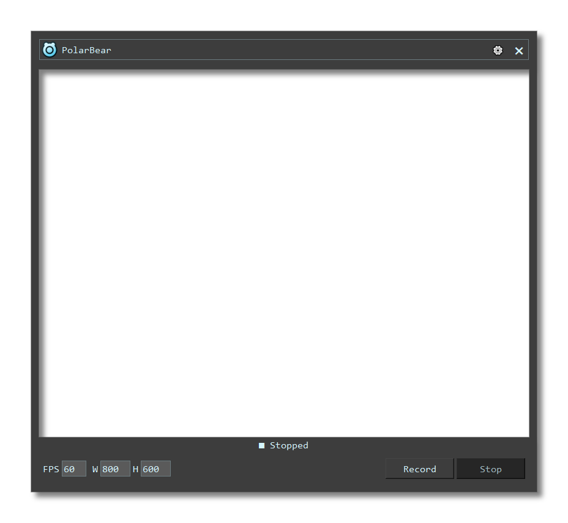
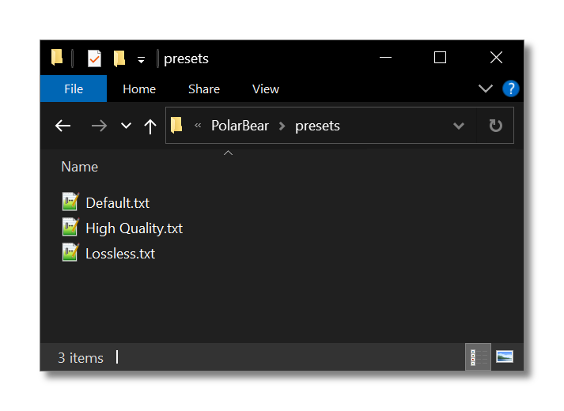

### [Click to download the latest version](https://github.com/kennedy0/PolarBear/releases/latest)

PolarBear is an application that makes it easy to record a section of your screen.

Position the window over the content you want to capture and click **Record**.




## Video Presets
PolarBear ships with a few presets for lightweight mp4 recording.
The default should be sufficient for most people.

If you want to customize your presets, click the **Open Presets Folder** button in the options screen.
Presets are stored as text files.
You can add, edit, or delete preset files.



After creating or deleting a preset file, click the **Refresh Presets** button to see the changes reflected in the
options screen.

FFmpeg is used to do the screen capture, and presets are just FFmpeg commands with some special, required keywords.
Click **Presets Help** to view a list of the required keywords.
If you want to create a new preset, it's easiest to start by copying an existing one, and leaving any `<KEYWORD>` in
brackets alone.

#### Example Windows preset using gdigrab
```
<FFMPEG>
-f gdigrab
-framerate <FPS>
-offset_x <X> -offset_y <Y>
-video_size <SIZE>
-i desktop
-c:v libx264
-pix_fmt yuv422p
-crf 23
-preset ultrafast
-tune zerolatency
-vsync 1
-y
<OUTPUT>.mp4
```

See the [FFmpeg documentation](https://ffmpeg.org/ffmpeg.html) for information on FFmpeg commands in general,
and the [FFmpeg devices documentation](https://ffmpeg.org/ffmpeg-devices.html) for specifics on capturing devices.

## Audio
Because PolarBear uses FFmpeg commands to capture video, the command to capture audio will be different on each system.
If you need to capture audio, you'll need to create a preset specific to your system.

## Log Files
If something goes wrong with the video recording, you can check the log files for the full output of the FFmpeg process.
The log files are stored in a folder alongside the user presets.

Windows: `%USERPROFILE%\.config\PolarBear\logs`

Linux: `~/.config/PolarBear/logs`
