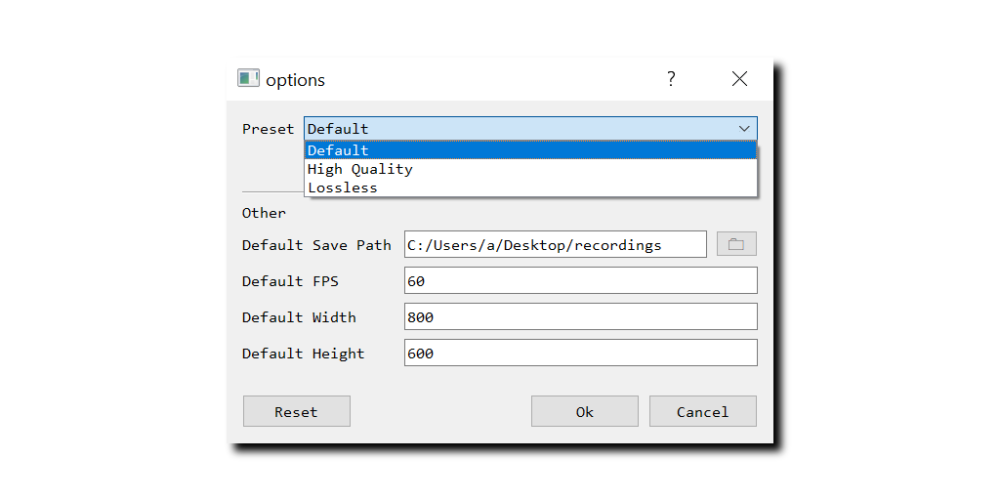

### [Click to download the latest version](https://github.com/kennedy0/PolarBear/releases/latest)

PolarBear is a simple application that makes it easy to record a region of your desktop.

Position the empty region of the window over the content you want to capture and click **Record**.

## FFmpeg
FFmpeg is used under the hood to do the screen capture.
PolarBear ships with a few presets for lightweight mp4 recording,
but users are free to modify or add new presets to suit their needs. 

